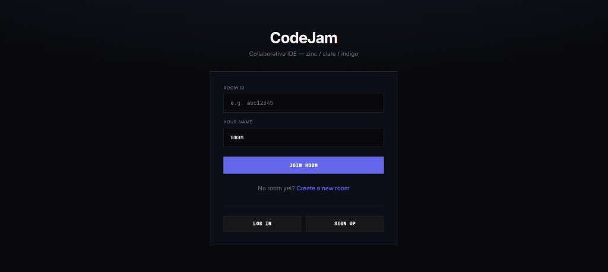
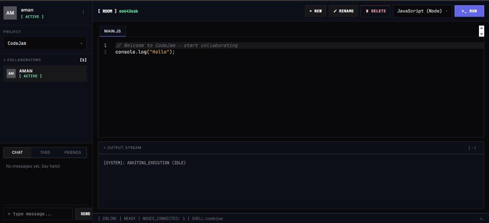

# CodeJam

**Collaborative IDE — zinc / slate / indigo**

CodeJam is a real-time collaborative coding platform. Multiple users can join a room, edit files together, run code, chat, and use voice — all in a professional dark-mode IDE built with React, Socket.IO, and Monaco Editor.

---

## Screenshots

### Landing page — join or create a room



### Collaborative room — editor, output, chat & voice



---

## Features

| Feature | Description |
|--------|-------------|
| **Real-time editor** | Multi-file Monaco editor with live sync across all room members |
| **Code execution** | Run JavaScript (Node), Python, C++, and Java via JDoodle API |
| **Room collaboration** | Create or join rooms with a unique Room ID |
| **Multi-file workspace** | Create, switch, rename, and delete files (admin-only rename/delete) |
| **Presence tracking** | See who is working on which file |
| **Live chat** | Room chat with replies, typing indicators, and local persistence |
| **Voice chat** | WebRTC push-to-talk voice between peers |
| **Authentication** | JWT-based signup/login with protected room creation |
| **System-style output** | Terminal-inspired logs with exit codes and execution timing |

---

## Tech Stack

### Frontend
- **React 19** + **Vite 8**
- **Tailwind CSS 4** (custom design tokens)
- **Monaco Editor** — syntax highlighting & IntelliSense
- **Socket.IO Client** — real-time collaboration
- **Axios** — REST API calls
- **React Router** — `/` and `/room/:id`
- **React Hot Toast** — system-style notifications

### Backend
- **Node.js** + **Express 5**
- **Socket.IO** — WebSocket events for rooms, files, chat, voice
- **MongoDB** + **Mongoose** — users, rooms, files
- **JWT** + **bcrypt** — authentication
- **JDoodle API** — remote code compilation & execution

---

## UI Design System

CodeJam uses a **principal engineer** dark theme:

| Token | Value | Usage |
|-------|-------|-------|
| Background | `#09090b` | Canvas / editor |
| Panel | `#0b0f19` | Sidebar, header |
| Border | `#27272a` | Dividers, frames |
| Primary text | `#f4f4f5` | Code, active tabs |
| Muted text | `#71717a` | Labels, inactive tabs |
| Status accent | `#34d399` | `[ ACTIVE ]`, Room ID |
| Primary action | `#6366f1` | `>_ RUN`, Join room |

- **Typography:** Inter (UI) + JetBrains Mono (code & console)
- **Layout:** Sharp corners, zinc grid, bottom-docked chat panel
- **Status format:** `[ ONLINE ] READY | NODES_CONNECTED: N | SHELL:codejam`

---

## Project Structure

```
CodeJam-main/
├── backend/
│   ├── server.js              # Express + Socket.IO entry point
│   ├── Actions.js             # Socket event name constants
│   ├── .env                   # Environment variables (not committed)
│   └── src/
│       ├── controllers/       # Auth & room logic
│       ├── db/                # MongoDB connection
│       ├── middlewares/       # JWT auth middleware
│       ├── models/            # User, Room, File schemas
│       └── routes/            # /api/auth, /api/rooms
├── frontend/
│   ├── public/
│   └── src/
│       ├── components/
│       │   ├── Auth/          # Login & Signup modals
│       │   ├── Editor/        # CodeEditor (Monaco)
│       │   └── Room/          # Sidebar, chat, voice, members
│       ├── constants/         # Socket ACTIONS
│       ├── context/           # AuthContext
│       ├── pages/             # Home, Room
│       ├── services/          # API & socket clients
│       └── utils/             # Theme, toasts, system logs
├── docs/
│   └── screenshots/           # Project screenshots
└── README.md
```

---

## How It Works

1. **Sign up / Log in** — Create an account or authenticate on the home page.
2. **Create a room** — Logged-in users can create a room and receive a unique Room ID.
3. **Join a room** — Enter the Room ID and display name, then click **Join room**.
4. **Collaborate** — Edit files in real time; changes sync instantly via Socket.IO.
5. **Run code** — Select a language and press `>_ RUN`; output appears in the output stream.
6. **Communicate** — Use the **Chat**, **Tabs**, or **Friends** (voice) panels in the sidebar.

---

## Getting Started

### Prerequisites

- **Node.js** v18+ (v22 tested)
- **MongoDB** running locally or a remote connection string
- **JDoodle API credentials** (for code execution) — [jdoodle.com](https://www.jdoodle.com/)

### 1. Clone the repository

```bash
git clone <your-repo-url>
cd CodeJam-main
```

### 2. Backend setup

```bash
cd backend
npm install
```

Create `backend/.env`:

```env
PORT=5000
MONGO_URI=mongodb://127.0.0.1:27017/codejam
JWT_SECRET=your-secret-key-change-in-production
JDOODLE_CLIENT_ID=your-jdoodle-client-id
JDOODLE_CLIENT_SECRET=your-jdoodle-client-secret
```

Start the server:

```bash
npm start
# Server runs on http://localhost:5000
```

> **Note:** Restart the backend after changing `.env`. If port 5000 is in use, stop the existing process first.

### 3. Frontend setup

```bash
cd frontend
npm install
```

Optional — create `frontend/.env` if the API is not on localhost:5000:

```env
VITE_API_URL=http://localhost:5000
```

Start the dev server:

```bash
npm run dev
# Open the URL shown in the terminal (usually http://localhost:5173)
```

### 4. Production build

```bash
cd frontend
npm run build
npm run preview
```

---

## API Reference

### Authentication

| Method | Endpoint | Auth | Description |
|--------|----------|------|-------------|
| `POST` | `/api/auth/signup` | No | Create account `{ username, email, password }` |
| `POST` | `/api/auth/login` | No | Login `{ email, password }` → `{ token, user }` |

### Rooms

| Method | Endpoint | Auth | Description |
|--------|----------|------|-------------|
| `POST` | `/api/rooms` | Bearer JWT | Create a new room → `{ roomId }` |
| `GET` | `/api/rooms/:roomId` | Optional | Get room metadata → `{ isAdmin, ... }` |

### Code execution

| Method | Endpoint | Auth | Description |
|--------|----------|------|-------------|
| `POST` | `/compile` | No | Run code `{ code, language }` via JDoodle |

**Supported languages:** `nodejs`, `python3`, `cpp`, `java`

---

## Socket Events

Real-time events (see `backend/Actions.js` and `frontend/src/constants/actions.js`):

| Event | Purpose |
|-------|---------|
| `join` / `joined` | User joins a room |
| `disconnected` | User leaves |
| `files-state` | Initial file list & presence |
| `file-create` / `file-created` | New file |
| `file-switch` / `file-switched` | Active file change |
| `file-code-change` | Live code sync |
| `file-rename` / `file-delete` | Admin file management |
| `file-presence-state` | Who is on which file |
| `chat-message` | Room chat |
| `typing` | Typing indicator |
| `voice-offer` / `voice-answer` / `voice-ice-candidate` | WebRTC voice |

---

## Environment Variables

| Variable | Required | Description |
|----------|----------|-------------|
| `PORT` | No | Backend port (default `5000`) |
| `MONGO_URI` | Yes | MongoDB connection string |
| `JWT_SECRET` | Yes | Secret for signing JWT tokens |
| `JDOODLE_CLIENT_ID` | Yes* | JDoodle client ID for `/compile` |
| `JDOODLE_CLIENT_SECRET` | Yes* | JDoodle client secret |
| `VITE_API_URL` | No | Frontend API base URL (default `http://localhost:5000`) |

\* Required for code execution. Without them, run returns a configuration error.

---

## Troubleshooting

| Issue | Fix |
|-------|-----|
| `EADDRINUSE` on port 5000 | Stop the existing Node process, then restart the backend |
| Code execution not configured | Add JDoodle keys to `backend/.env` and restart the server |
| Cannot reach backend | Ensure backend is running and `VITE_API_URL` is correct |
| MongoDB connection failed | Start MongoDB or update `MONGO_URI` |

---

## License

MIT License

---

*Built with CodeJam — real-time collaborative coding.*
